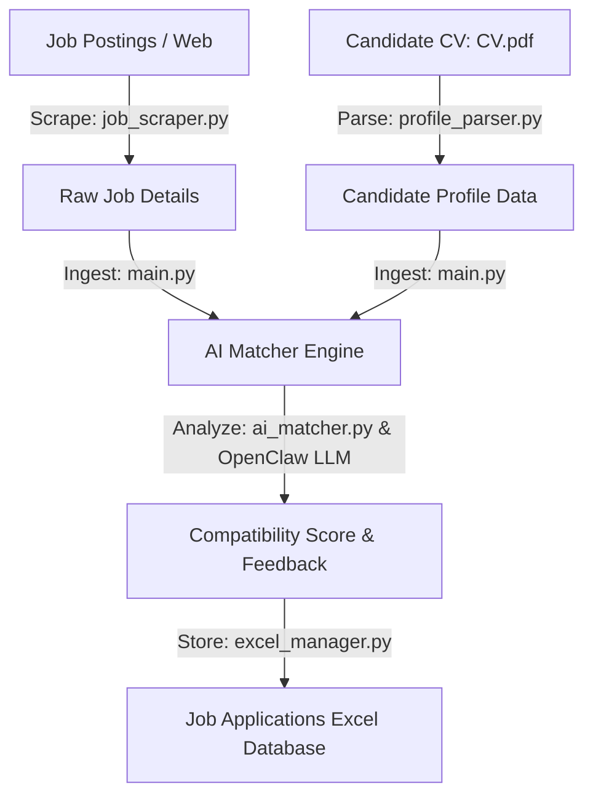

# Job Scraping & AI Resume Matcher Pipeline 🕷️🤖

A modular Python-based ETL pipeline that automates job hunting. It scrapes live job postings, parses PDF resumes/CVs, matches candidate skills using a local LLM (OpenClaw), and logs structured matching results into a spreadsheet database.

---

## 📊 Pipeline Architecture



---

## 🛠️ Tech Stack & Dependencies

* **Scraping**: `BeautifulSoup4`, `Playwright` (for dynamic page rendering)
* **Parsing**: `PyMuPDF` (Fitz) for PDF text extraction
* **Data Processing**: `Pandas`, `OpenPyXL` (for Excel tracking management)
* **AI reasoning**: `OpenClaw` (Local LLM API integration)
* **Environment Control**: `python-dotenv`

---

## 📂 Codebase Breakdown

* `main.py`: Entry point and orchestrator of the scraping and matching pipeline.
* `job_scraper.py`: Extracts job listings (titles, companies, descriptions) from target websites.
* `profile_parser.py`: Extracts and structures skills and experience from your CV.
* `ai_matcher.py`: Interfaces with OpenClaw LLM to rank and score the job match quality based on your CV profile.
* `excel_manager.py`: Writes, updates, and structures the matching results into `job_applications.xlsx`.
* `config.py`: Global environment variable loading and path configurations.

---

## 💻 Setup and Usage

### Prerequisites

* Python 3.10 to 3.13
* A running instance of [OpenClaw](https://github.com/openclaw) or an OpenAI-compatible local model server.

### Installation

1. Clone this repository:
   ```bash
   git clone https://github.com/[username]/Web-Scraping.git
   cd Web-Scraping
   ```

2. Create a virtual environment and activate it:
   ```bash
   python -m venv .venv
   # On Windows:
   .venv\Scripts\activate
   # On Unix/macOS:
   source .venv/bin/activate
   ```

3. Install the dependencies:
   ```bash
   pip install -r requirements.txt
   ```

4. Install Playwright browsers (required for dynamic scrapers):
   ```bash
   playwright install
   ```

### Configuration

1. Copy `.env.example` to `.env`:
   ```bash
   copy .env.example .env
   ```
2. Place your CV (as a PDF) in the root directory and name it `CV.pdf` (or customize the path in `.env`).
3. Update the `OPENCLAW_API_BASE` and `OPENCLAW_API_KEY` in your `.env` if your local model server runs on a different port.

### Running the Pipeline

Kick off the scraper and matcher:
```bash
python main.py
```
After execution, results will be saved/appended directly to your `job_applications.xlsx` database.
